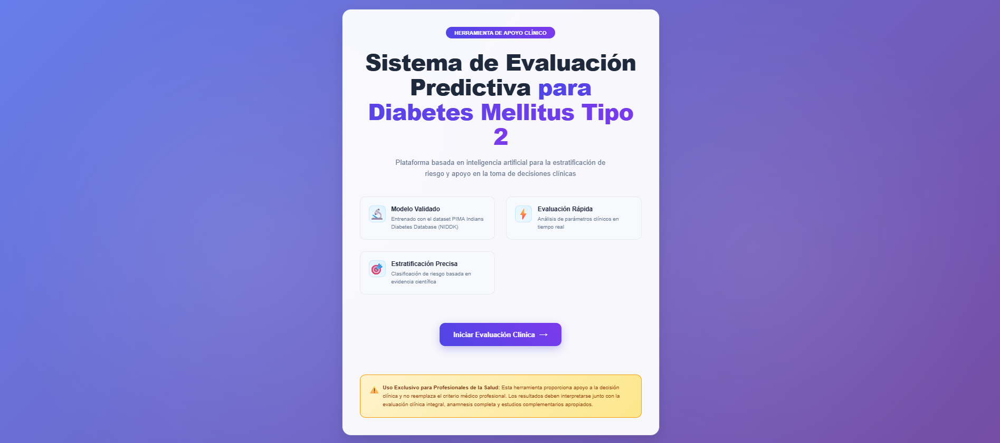
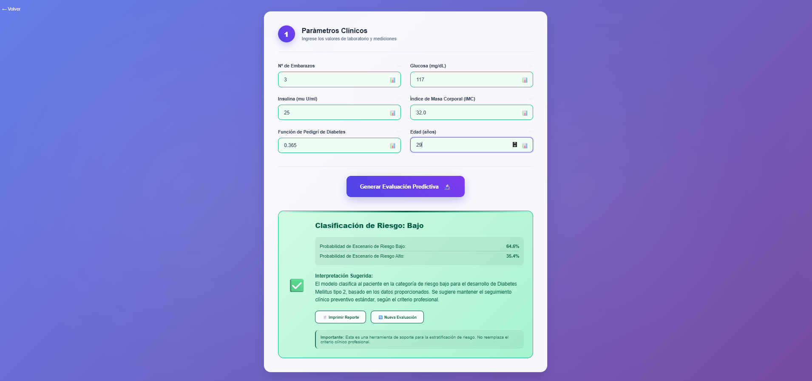

# Aplicacion





# Instalacion del proyecto

## Crear el entorno virtual (solo una vez)
```python3 -m venv .venv```

## Activar el entorno
```source .venv/bin/activate```

## Instalar dependencias
```pip install -r requirements.txt```

# Entrenamiento del modelo y ejecución del backend

## 1. Entrenar el modelo

Navegar a la carpeta de entrenamiento:
```bash
cd model_training
```

### Comparación de modelos (opcional)
Para ver una comparación entre diferentes algoritmos de machine learning:
```bash
python3 compare_models.py
```
> ⚠️ **Nota**: Este comando tarda varios minutos en ejecutarse. Es completamente opcional.

### Entrenar el modelo principal
```bash
python3 train_diabetes_predictor.py
```
Este script:
- Genera el modelo entrenado
- Crea el scaler para normalización
- Produce gráficos del análisis exploratorio de datos

## 2. Correr el backend

Salir de la carpeta de entrenamiento y navegar al backend:
```bash
cd backend
```

Iniciar el servidor:
```bash
uvicorn predict_diabetes_api:app --reload
```

El servidor estará disponible en `http://localhost:8000`

## 3. Probar la API

Una vez que el backend esté corriendo, puedes hacer una predicción:

```bash
curl -X POST "http://localhost:8000/predict/logistic_regression" \
-H "Content-Type: application/json" \
-d '{
  "Pregnancies": 2,
  "Glucose": 130,
  "Insulin": 85,
  "BMI": 28.5,
  "DiabetesPedigreeFunction": 0.5,
  "Age": 45
}'
```

### Parámetros de entrada
- **Pregnancies**: Número de embarazos
- **Glucose**: Nivel de glucosa
- **Insulin**: Nivel de insulina
- **BMI**: Índice de masa corporal
- **DiabetesPedigreeFunction**: Función de pedigrí de diabetes
- **Age**: Edad

La respuesta incluirá la predicción de probabilidad de diabetes.

# Frontend

## Instalar bibliotecas
```npm install```

## Iniciar el frontend
```npm run dev```